# 🛒 POS Tracker — Laravel E-Business Project

<div align="center">
  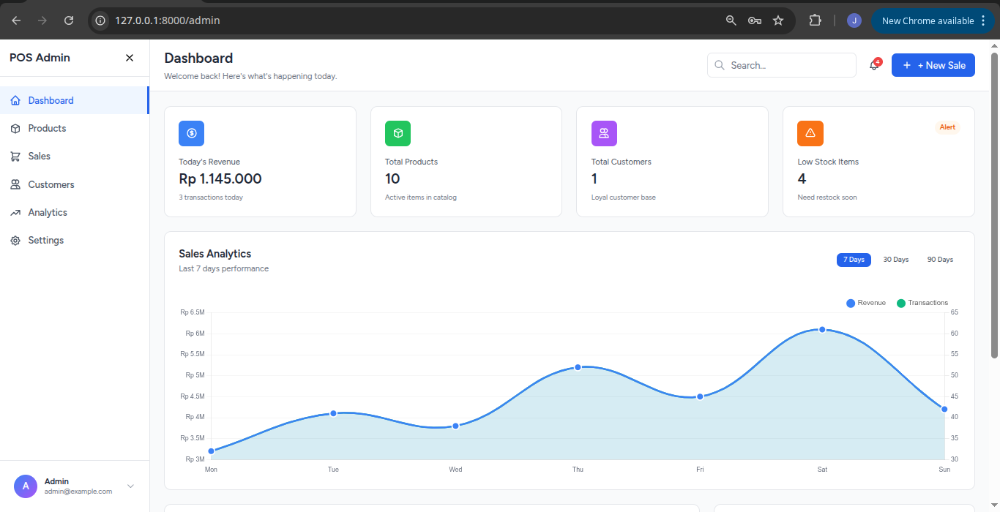
  <br>
  <b>Sistem Point of Sales (POS) Modern dengan Role-Based Access Control</b>
  <br>
  <i>Dibuat oleh: <b>Pangestu Aji Nugroho</b> | Mata Kuliah: <b>E-Business</b></i>
</div>

---

## 📋 Fitur Utama System

Sistem ini memiliki dua dashboard utama yang dipisahkan berdasarkan hak akses pengguna:

### 🛡️ Admin Panel
*   **Real-time Analytics**: Visualisasi data penjualan dan performa toko.
*   **Inventory Management**: Full CRUD Produk dengan notifikasi stok rendah.
*   **Customer Tracking**: Manajemen database pelanggan setia.
*   **Sales Report**: Laporan riwayat transaksi lengkap dari seluruh kasir.
*   **Shop Settings**: Pengaturan identitas toko (Nama, Alamat, Logo).

### � Kasir Dashboard
*   **Point of Sales (POS)**: Antarmuka kasir yang cepat dengan fitur pencarian produk.
*   **Real Checkout**: Pemrosesan transaksi nyata yang memotong stok secara otomatis.
*   **Payment Gateway Simulation**: Pilihan metode pembayaran (Cash/Transfer).
*   **Personal History**: Kasir bisa melihat riwayat penjualannya sendiri.
*   **Low Stock Alerts**: Peringatan stok menipis khusus untuk produk di area kasir.

---

## 📸 Dokumentasi Fitur (Screenshots)

### 📊 Dashboard & Login Experience
<table width="100%">
  <tr>
    <td width="33%" align="center">
      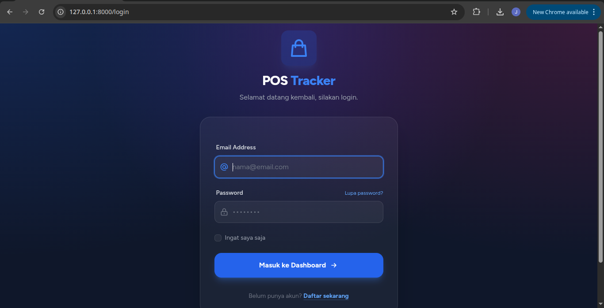
      <br><b>Halaman Login Premium</b>
    </td>
    <td width="33%" align="center">
      
      <br><b>Admin Dashboard</b>
    </td>
    <td width="33%" align="center">
      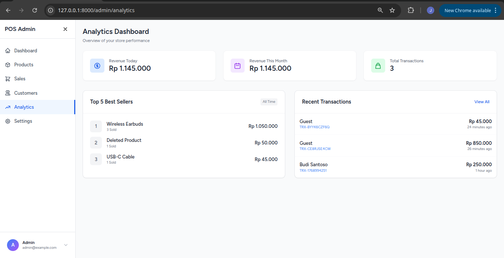
      <br><b>Modul Analytics</b>
    </td>
  </tr>
</table>

### 🛒 Proses Transaksi (POS)
<table width="100%">
  <tr>
    <td width="50%" align="center">
      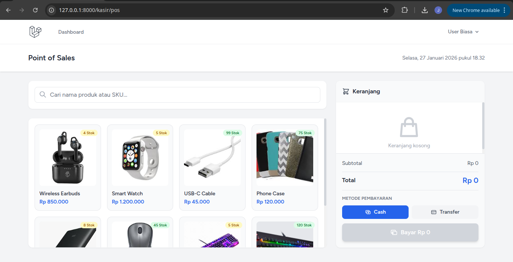
      <br><b>Interface Kasir (POS)</b>
    </td>
    <td width="50%" align="center">
      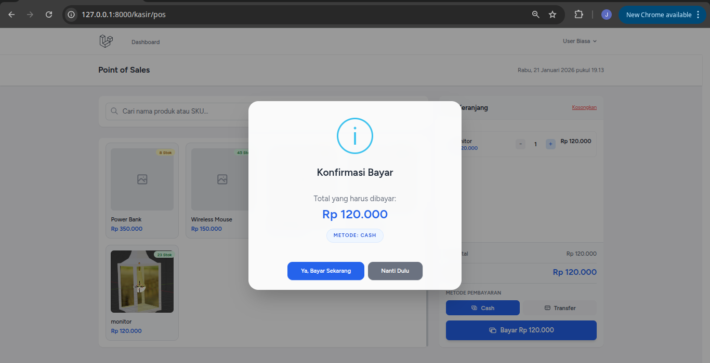
      <br><b>Konfirmasi Pembayaran Premium</b>
    </td>
  </tr>
</table>

### 📦 Manajemen Produk
<table width="100%">
  <tr>
    <td width="33%" align="center">
      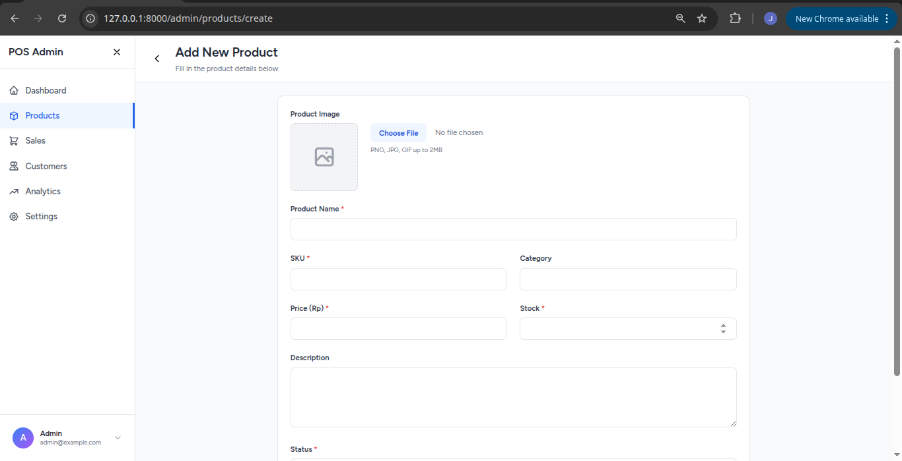
      <br><b>Tambah Produk</b>
    </td>
    <td width="33%" align="center">
      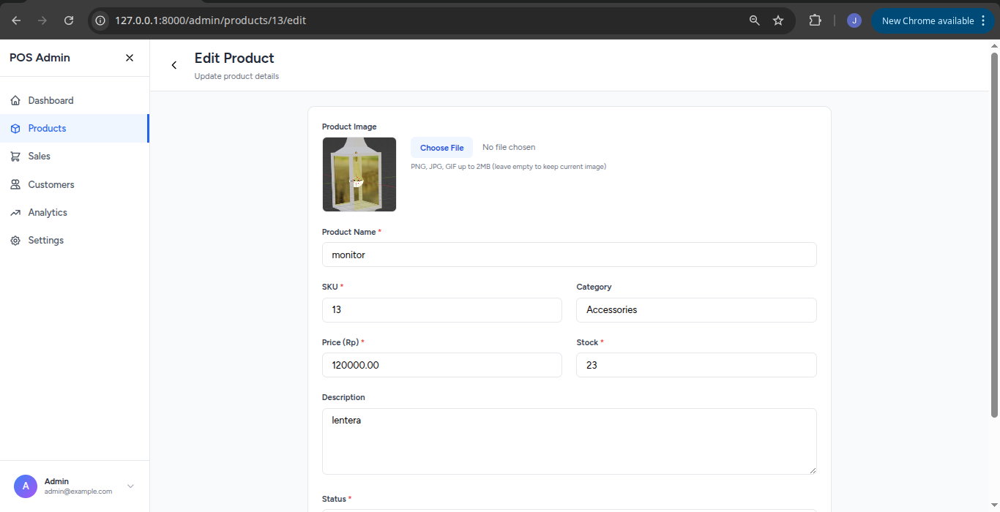
      <br><b>Edit Produk</b>
    </td>
    <td width="33%" align="center">
      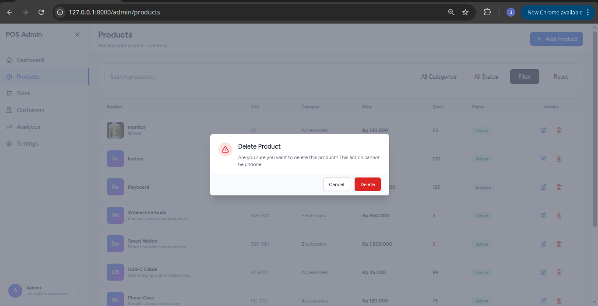
      <br><b>Konfirmasi Hapus</b>
    </td>
  </tr>
</table>

### 👥 Modul Tambahan
<table width="100%">
  <tr>
    <td width="25%" align="center">
      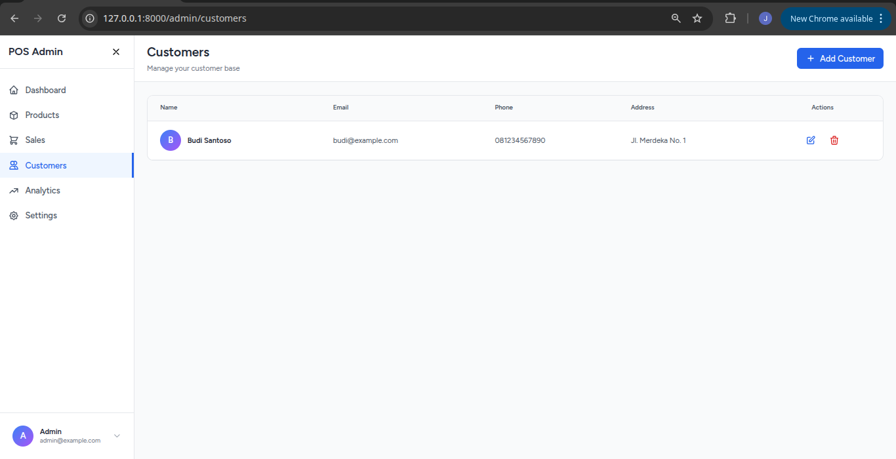
      <br><b>Manajemen Pelanggan</b>
    </td>
    <td width="25%" align="center">
      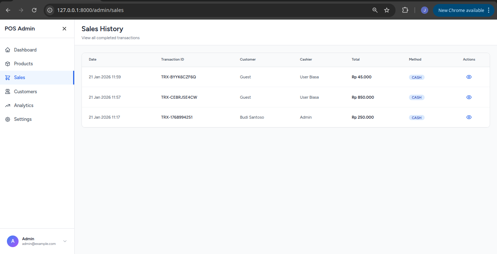
      <br><b>Riwayat Penjualan</b>
    </td>
    <td width="25%" align="center">
      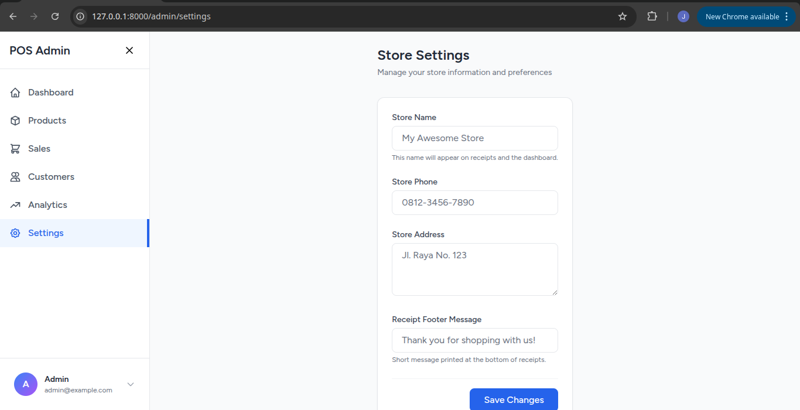
      <br><b>Pengaturan Toko</b>
    </td>
    <td width="25%" align="center">
      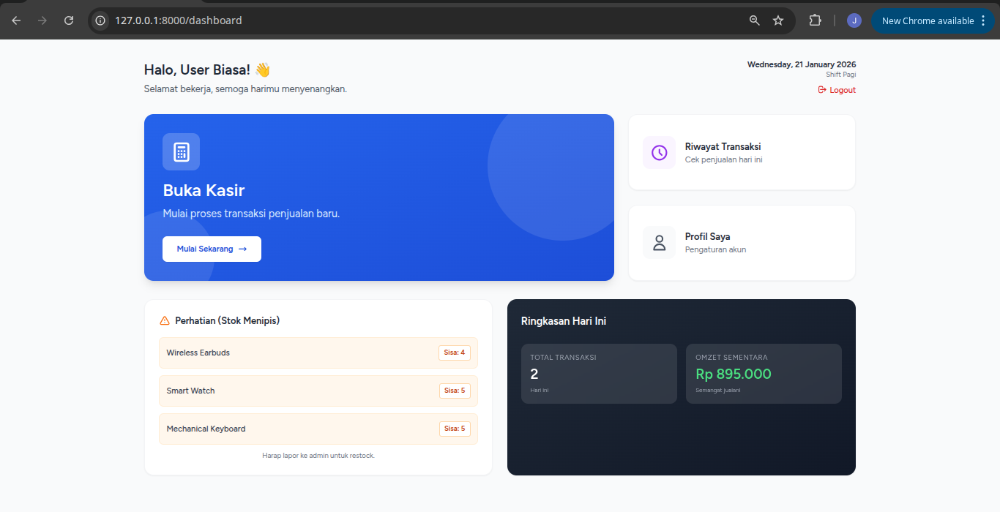
      <br><b>Dashboard Kasir</b>
    </td>
  </tr>
</table>

---

## �️ Tech Stack

| Teknologi | Versi | Peran |
|-----------|-------|-------|
| **Laravel** | 12.x | Backend Framework |
| **Tailwind CSS** | 3.x | UI Styling |
| **Alpine.js** | 3.x | Frontend Reactivity |
| **SweetAlert2** | 11.x | Premium UI Notifications |
| **MySQL** | 8.0+ | Database Persistence |
| **Animate.css** | 4.x | UI Animations |

---

## � Panduan Instalasi

Ikuti langkah-langkah di bawah untuk menjalankan project di lokal Anda:

1.  **Clone Repository**
    ```bash
    git clone https://github.com/A-klyr/ebusiness2-pangestu_aji_n.git
    cd ebusiness2-pangestu_aji_n
    ```

2.  **Install Dependencies**
    ```bash
    composer install
    npm install
    ```

3.  **Setup Environment**
    ```bash
    cp .env.example .env
    php artisan key:generate
    ```

4.  **Database Migration & Seeding**
    *Pastikan database MySQL sudah aktif dan detailnya dikonfigurasi di file .env*
    ```bash
    php artisan migrate
    php artisan db:seed # Optional: Untuk data dummy awal
    ```

5.  **Compile Assets & Run Server**
    ```bash
    npm run dev
    # (Di terminal terpisah)
    php artisan serve
    ```

---

## 👨‍💻 Developer
**Pangestu Aji Nugroho**  
*Student of E-Business Course*  
Fokus: *Web Development & System Analysis*

---
<div align="center">
  <p>Dibuat dengan ❤️ menggunakan Laravel Ecosystem</p>
  <b>© 2026 POS Tracker Project</b>
</div>